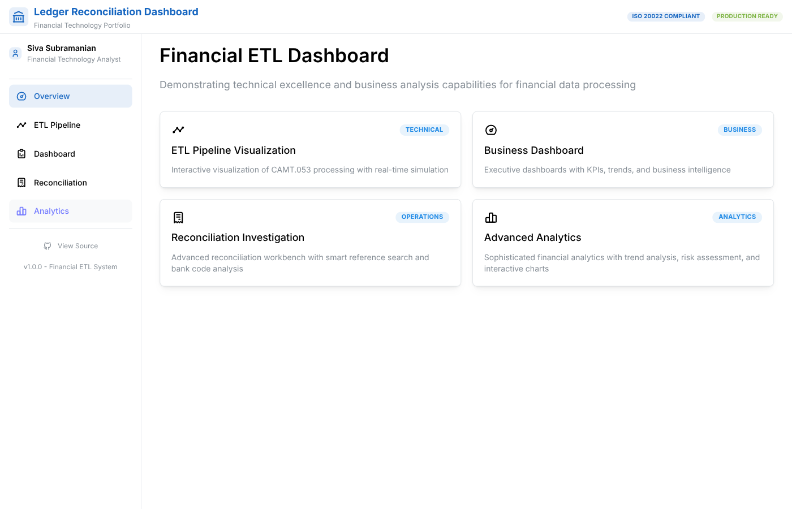
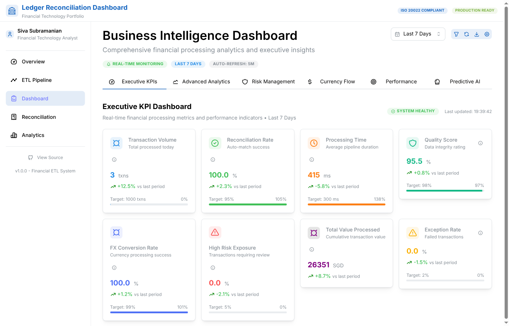
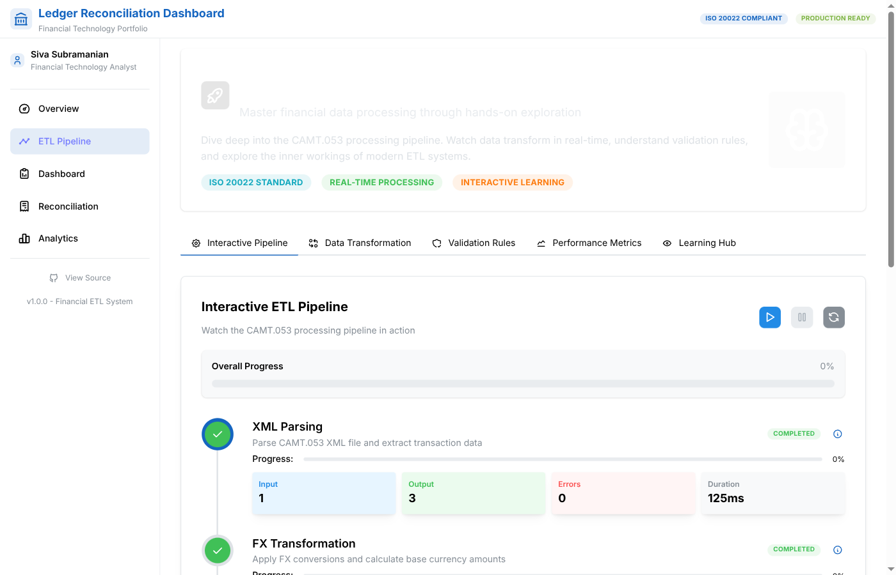
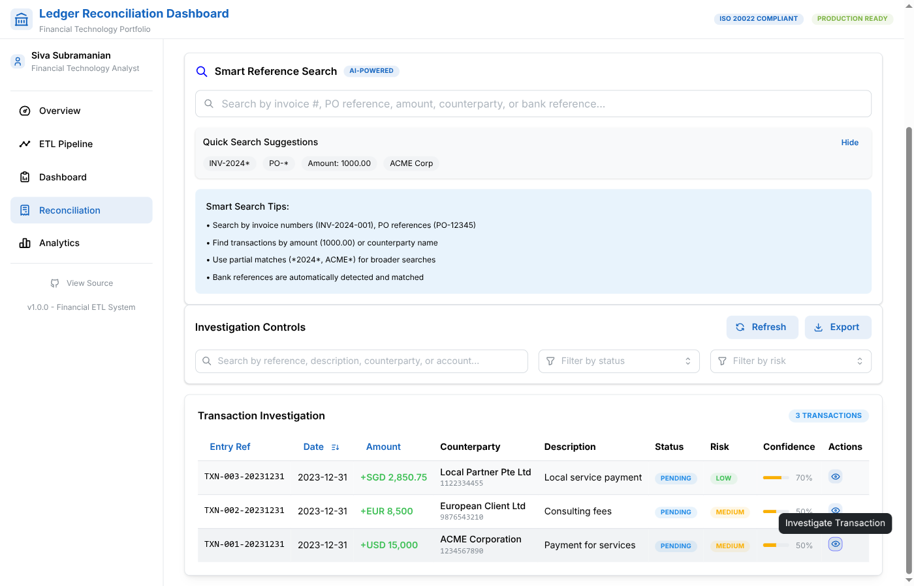
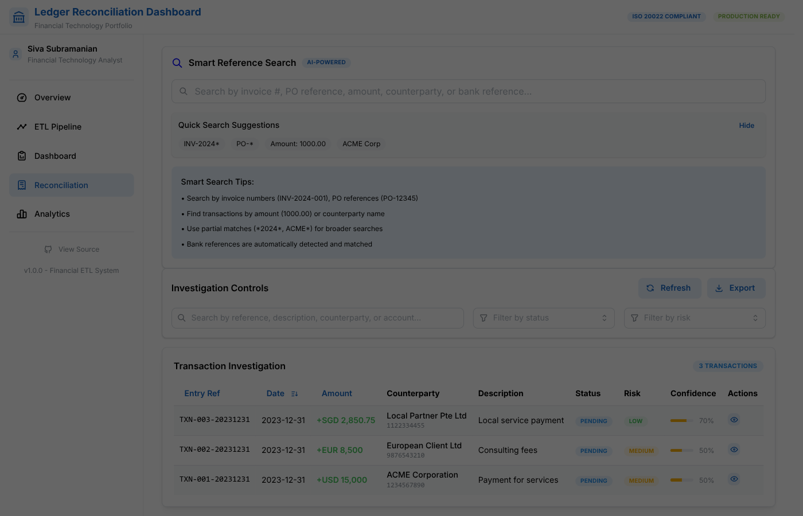
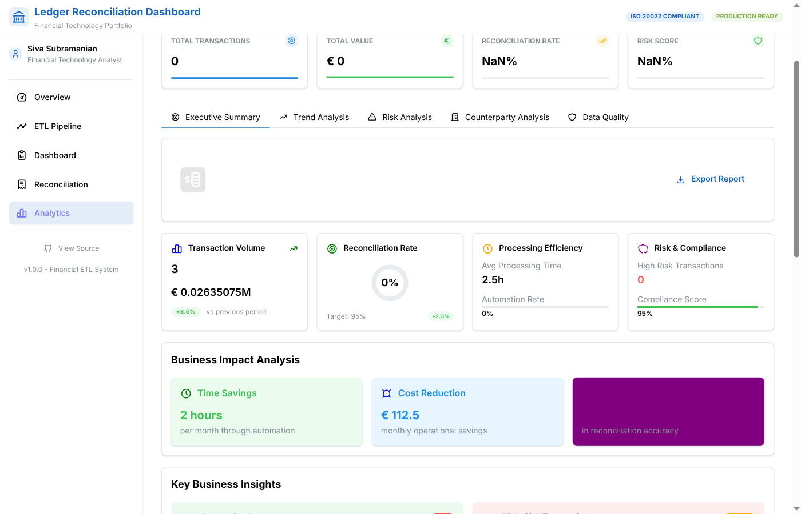

# Ledger Reconciliation Dashboard

## 🏦 Financial ETL Analytics Platform

A comprehensive financial reconciliation dashboard built with React, TypeScript, and Mantine UI. This application processes ISO 20022 CAMT.053 bank statements, performs automated reconciliation, and provides executive-level analytics for financial operations.


*Complete overview showing navigation and main features*

## 📸 Application Screenshots

### Main Dashboard Overview

*Executive KPI dashboard with real-time financial processing metrics*

### Interactive ETL Pipeline

*Interactive CAMT.053 processing pipeline with step-by-step visualization*

### Reconciliation Workbench

*Advanced reconciliation tool with AI-powered smart reference search*

### Transaction Investigation Modal

*Detailed transaction analysis with FX conversion and risk assessment*

### Analytics Dashboard

*Advanced financial analytics with business impact analysis and strategic recommendations*

## ✨ Features

### 🔄 ETL Pipeline Visualization
- **Interactive Process Flow**: Real-time visualization of data transformation steps
- **Step-by-Step Processing**: XML parsing, validation, FX conversion, and loading
- **Performance Metrics**: Processing times, success rates, and error tracking
- **Live Progress Monitoring**: Real-time updates during ETL execution

### 📊 Executive Dashboard
- **Financial KPIs**: Transaction volumes, risk distribution, and processing metrics
- **Multi-Currency Support**: USD, EUR, GBP, SGD, JPY, CNY, AUD, CHF
- **Risk Analytics**: High/Medium/Low risk categorization and distribution
- **Currency Analytics**: Exchange rate tracking and conversion metrics

### 🔍 Transaction Reconciliation
- **Smart Search**: Advanced filtering by amount, date, counterparty, and risk level
- **Bank Code Translation**: Automatic ISO 20022 bank transaction code interpretation
- **Transaction Details**: Comprehensive view with FX conversions and validation results
- **Status Management**: MATCHED, PENDING, EXCEPTION, REVIEWED tracking

### 📈 Advanced Analytics
- **Data Quality Scorecard**: Completeness, accuracy, and consistency metrics
- **Drill-Down Analysis**: Interactive charts with detailed breakdowns
- **Trend Analysis**: Historical patterns and anomaly detection
- **Export Capabilities**: PDF, Excel, and CSV export functionality

## 🛠 Technology Stack

- **Frontend**: React 19, TypeScript, Vite
- **UI Framework**: Mantine UI v8
- **Charts**: Recharts, Mantine Charts
- **Routing**: React Router v7
- **State Management**: TanStack React Query
- **Build Tool**: Vite 7
- **Testing**: Vitest, Testing Library
- **Deployment**: GitHub Pages

## 🚀 Getting Started

### Prerequisites
- Node.js 18+ 
- npm or yarn

### Installation

1. **Clone the repository**
   ```bash
   git clone https://github.com/sivasub987/ledger-reconciliation-dashboard.git
   cd ledger-reconciliation-dashboard
   ```

2. **Install dependencies**
   ```bash
   npm install
   ```

3. **Start development server**
   ```bash
   npm run dev
   ```

4. **Build for production**
   ```bash
   npm run build
   ```

### Available Scripts

- `npm run dev` - Start development server
- `npm run build` - Build for production
- `npm run preview` - Preview production build
- `npm run lint` - Run ESLint
- `npm run type-check` - Run TypeScript type checking
- `npm run test` - Run tests
- `npm run test:coverage` - Run tests with coverage

## 🏗 Project Structure

```
├── src/
│   ├── components/          # Reusable UI components
│   │   ├── analytics/       # Analytics components
│   │   ├── charts/          # Chart components
│   │   ├── common/          # Shared components
│   │   ├── dashboard/       # Dashboard components
│   │   ├── etl/            # ETL visualization components
│   │   └── reconciliation/ # Reconciliation components
│   ├── hooks/              # Custom React hooks
│   ├── pages/              # Page components
│   ├── services/           # Business logic and data processing
│   ├── stores/             # State management
│   ├── types/              # TypeScript type definitions
│   └── utils/              # Utility functions
├── public/
│   └── data/               # Sample data files
├── tests/                  # Test files
└── docs/                   # Documentation
```

## 📄 ISO 20022 Compliance

This application fully supports ISO 20022 CAMT.053 (Bank-to-Customer Cash Management) standard:

- **Message Structure**: Complete CAMT.053 XML parsing
- **Bank Transaction Codes**: Domain-Family-Subfamily hierarchy support
- **Entry Status**: BOOK, PDNG, INFO status handling
- **Multi-Currency**: Proper currency code and conversion support
- **Counterparty Info**: BIC, IBAN, and account details
- **Remittance Information**: Structured and unstructured remittance data

## 🎯 Demo Data

The application includes comprehensive demo data with:

- **55+ Sample Transactions**: Diverse transaction types and currencies
- **Multiple Bank Codes**: SEPA, wire transfers, direct debits, investment transactions
- **Risk Scenarios**: Various risk levels and reconciliation statuses
- **FX Conversions**: Realistic exchange rates and conversion data
- **Validation Results**: Compliance checks and validation outcomes

## 🔧 Configuration

### Environment Variables
No environment variables required for basic operation. All data is loaded from static JSON files.

### Customization
- **Themes**: Modify `src/styles/` for custom styling
- **Data Sources**: Update `src/services/dataProcessor.ts` for different data sources
- **Bank Codes**: Extend `src/services/bankCodeTranslation.ts` for additional codes

## 📱 Responsive Design

Fully responsive design supporting:
- **Desktop**: Optimized for large screens with detailed views
- **Tablet**: Collapsible navigation and responsive charts
- **Mobile**: Mobile-first approach with touch-friendly interface

## 🔒 Security Features

- **Input Validation**: Comprehensive data validation
- **XSS Protection**: Sanitized data rendering
- **Type Safety**: Full TypeScript coverage
- **Error Handling**: Graceful error handling and fallbacks

## 🌐 Browser Support

- **Chrome**: 90+
- **Firefox**: 88+
- **Safari**: 14+
- **Edge**: 90+

## 🤝 Contributing

1. Fork the repository
2. Create a feature branch (`git checkout -b feature/amazing-feature`)
3. Commit changes (`git commit -m 'Add amazing feature'`)
4. Push to branch (`git push origin feature/amazing-feature`)
5. Open a Pull Request

## 📝 License

This project is available for use under standard open source practices.

## 👨‍💻 Author

**Sivasubramanian Ramanthan**  
[Website](https://sivasub.com) | [LinkedIn](https://www.linkedin.com/in/sivasub987) | [Email](mailto:hello@sivasub.com)

## 🙏 Acknowledgments

- **ISO 20022**: For the comprehensive financial messaging standards
- **Mantine**: For the excellent React UI components
- **React Team**: For the powerful React framework
- **TypeScript**: For type safety and developer experience

---

⭐ **Star this repository if you find it helpful!**

🔗 **Live Demo**: [https://sivasub987.github.io/ledger-reconciliation-dashboard/](https://sivasub987.github.io/ledger-reconciliation-dashboard/)